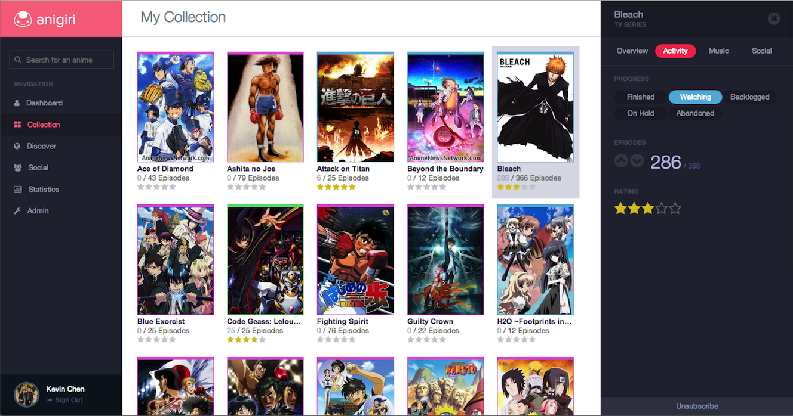

Anigiri
=======

An anime collection system that you can share with your friends.

Notes
------------
A system that allows users to track animes and share their favourites with friends. Can also receive information about your currently watchcing animes and notifies you when new episodes are out. Requires Facebook sign in as the basis of user identification. This project was built using the MeteorJS framework. 

This project is a rebound and extension of the following legacy projects:
+ [AnimeRecord](https://github.com/k39chen/AnimeRecord)
+ [AnimeTracker](https://github.com/k39chen/AnimeTracker)

Usage
------------
To start using **Anigiri** [click here](http://anigiri.meteor.com/).

Credits
-------------
Special thanks to [Eddie Zhang](https://github.com/Mrez95) who inspired and motivated the development of this game.

Special thanks goes to the Meteor team. Enjoyed the use of the [Meteor JS Framework](http://www.meteor.com/).

License
-------------
Copyright (c) 2014 Kevin Chen.
